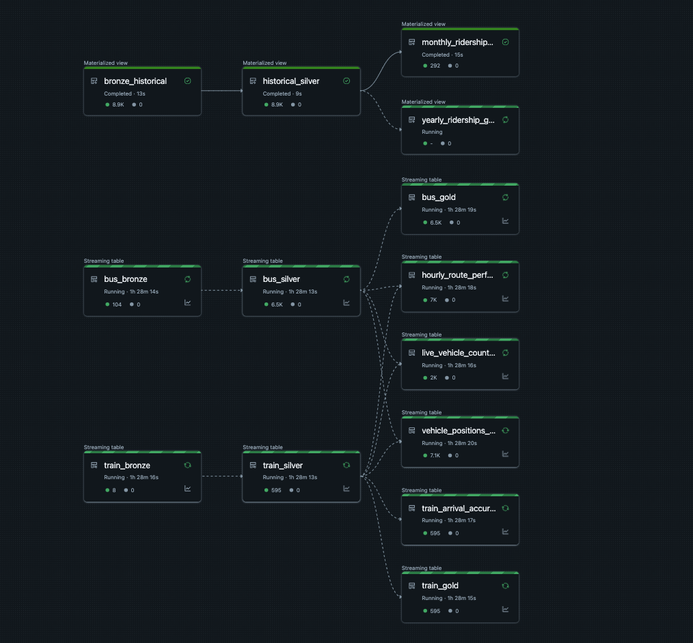

# 🚍 CTA Real-Time Transit Analytics Pipeline using Databricks DLT

This project builds an end-to-end **real-time data pipeline** using the **Chicago Transit Authority (CTA)** Train & Bus Tracker APIs and historical CSV data. Leveraging **Delta Live Tables (DLT)** on **Databricks**, the pipeline processes streaming data, applies quality checks, and generates actionable Gold-layer KPIs for real-time analytics and dashboards.

---

## 📚 Table of Contents

- [🧱 Project Structure](#-project-structure)  
- [🗺️ Pipeline Architecture](#-pipeline-architecture)  
- [📈 Data Flow Summary](#-data-flow-summary)  
- [✅ Features](#-features)  
- [📊 Example KPIs Tracked](#-example-kpis-tracked)  
- [🛠️ Technologies Used](#-technologies-used)  
- [📌 Future Enhancements](#-future-enhancements)  
- [🔗 Reference](#-reference)  
- [📄 License](#-license)  
- [🤝 Contributing](#-contributing)  

---

## 🧱 Project Structure

The project is organized into modular folders representing API ingestion, DLT notebooks, and sample resources.

### 📡 `api/` – Real-Time Ingestion Scripts

> Connects to CTA APIs and streams real-time data to Databricks Volumes.

- `bus_streaming_api.py` – 🚌 Streams real-time bus location and route info  
- `train_streaming_api.py` – 🚆 Fetches real-time train arrival predictions and vehicle locations  

### 📓 `notebooks/` – Delta Live Tables Pipeline

> Defines the Medallion architecture (Bronze → Silver → Gold)

- `bronze_dlt.py` – Ingests raw JSON & CSV into Bronze tables  
- `silver_dlt.py` – Cleans & enriches Bronze data into structured Silver tables  
- `gold_dlt.py` – Aggregates Silver data into BI-ready Gold tables  

### 📁 `resources/cta-samples/` – Sample Data

> For local testing or demo purposes

- `bus_data.json` – Sample from CTA Bus API  
- `train_data.json` – Sample from CTA Train API  
- `ridership_historical.csv` – Daily station-level ridership  

---

## 🗺️ Pipeline Architecture

Below is the end-to-end architecture of the CTA real-time streaming pipeline powered by Delta Live Tables.

---

## 📈 Data Flow Summary

A step-by-step overview of the data flow:

### 🔌 1. API Ingestion (External Input)

- ⏱️ Run every 10 minutes via Databricks Jobs  
- Ingests JSON from:
  - 🚌 CTA Bus Tracker API
  - 🚆 CTA Train Tracker API  
- Raw files stored in:
  - `/Volumes/cta_project/landing/bus/`  
  - `/Volumes/cta_project/landing/train/`  

---

### 🥉 2. Bronze Layer — *Raw Zone*

- Tech: **Autoloader**, **DLT Streaming Tables**  
- Tables: `bus_bronze`, `train_bronze`, `bronze_historical`  
- No transformations, just ingestion for traceability  

---

### 🥈 3. Silver Layer — *Refined Zone*

- Defined in `silver_dlt.py`  
- Cleansing and enrichment:
  - Schema normalization
  - Null filtering
  - Type casting  
- Output: `bus_silver`, `train_silver`, `historical_silver`

---

### 🥇 4. Gold Layer — *Business Zone*

- Defined in `gold_dlt.py`  
- Business KPIs:
  - `train_arrival_accuracy`
  - `hourly_route_performance`
  - `vehicle_positions_current`
  - `monthly_ridership_summary`  
- Optimized for dashboarding and alerts

---

### 🗃️ 5. Materialized Views — *Historical Insights*

- Built from `ridership_historical.csv`  
- Output:
  - `monthly_ridership_summary`
  - `yearly_ridership_grouped`  
- Refreshed periodically (not real-time)

---

## ✅ Features

- 🔁 **Real-Time Streaming** with Autoloader + Delta Live Tables  
- 🧹 **Quality Checks** using `@dlt.expect_or_drop` rules  
- 🧱 **Modular ETL Architecture** (Bronze, Silver, Gold)  
- 📬 **Scheduled Ingestion** every 10 minutes  
- 📊 **BI-Ready Tables** with KPIs like live vehicle count and route performance  
- 🗃️ **Local Dev Support** via JSON/CSV sample files  

---

## 📊 Example KPIs Tracked

- ⏱️ Train Arrival Accuracy by Station  
- 🚏 Live Vehicle Count (bus/train)  
- 🕒 Hourly Route Delay/Performance  
- 📈 Monthly/Yearly Ridership Patterns  
- 🗺️ Real-Time Vehicle GPS Snapshots  

---

## 🛠️ Technologies Used

### 💻 Databricks Platform

| Component         | Description                                     |
|------------------|-------------------------------------------------|
| 🧱 **Delta Live Tables (DLT)** | Core ETL framework (Bronze → Silver → Gold) |
| ⏰ **Jobs Scheduler**         | Ingests data every 10 minutes          |
| 🔐 **Unity Catalog**         | Governance, metadata, and access control |

### ⚙️ Core Stack

| Technology         | Role                                           |
|-------------------|------------------------------------------------|
| ⚡ PySpark         | Transformations, aggregations, validation      |
| 💾 Delta Lake      | ACID-compliant format for medallion layers     |
| 🔄 Autoloader      | Incremental file ingestion from Volumes        |

### 🌐 Data Sources

| Source                     | Description                           |
|----------------------------|---------------------------------------|
| 🚌 CTA Bus Tracker API     | Real-time location, routes, vehicles   |
| 🚆 CTA Train Tracker API   | Live train predictions, GPS data      |
| 📊 CTA Historical CSVs     | Station-level ridership summaries     |

### 🐍 Tools

| Tool     | Purpose                           |
|----------|-----------------------------------|
| 🐍 Python | API ingestion, transformation     |
| 🌐 GitHub | Version control & hosting         |

---

## 📌 Future Enhancements

- 📬 Real-Time Alerts via Email
- 📈 Integration with Power BI / Tableau dashboards
- ☁️ Deploy on AWS with S3, Glue, and Athena
- 📦 Add CI/CD and unit testing with Pytest
- 🗺️ Add route-level geospatial visualizations

--

## 🔗 Reference

- [CTA Bus Tracker API Docs](http://www.ctabustracker.com/bustime/api/)
- [CTA Train Tracker API Docs](https://www.transitchicago.com/developers/traintracker/)
- [CTA Ridership Dataset](https://data.cityofchicago.org/Transportation/CTA-Ridership-Bus-Rail-/qbay-iu28)

---

## 📄 License

This project is licensed under the [MIT License](LICENSE).

